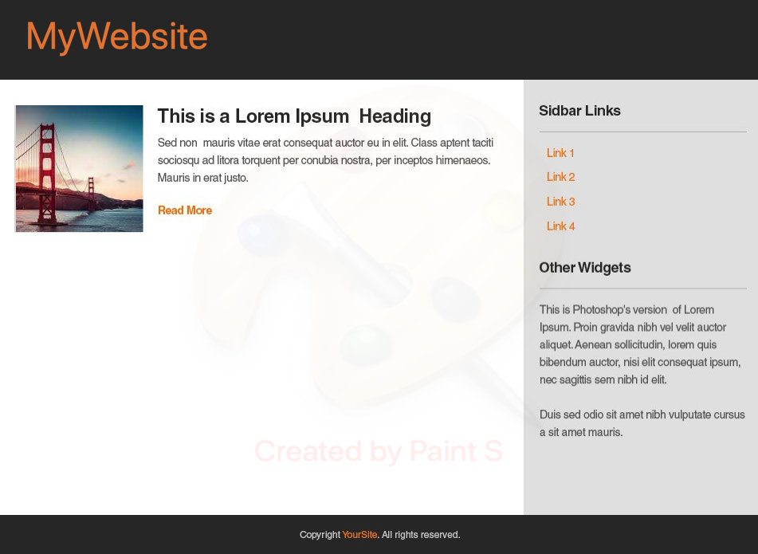
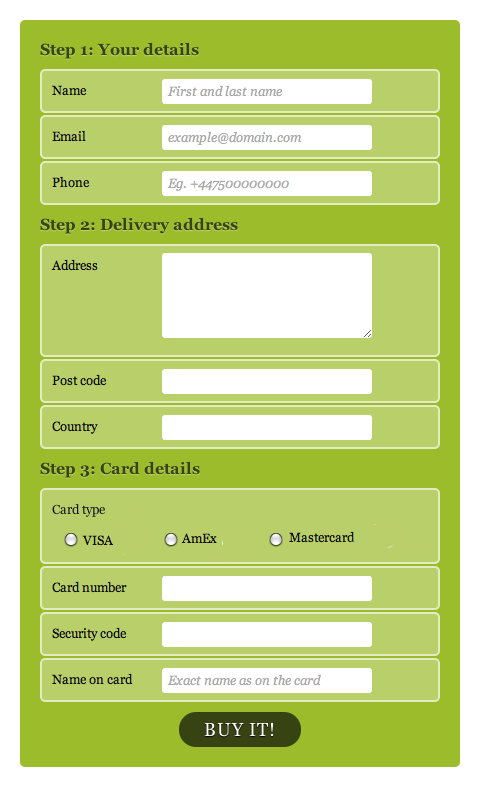

# HTML CSS Partner Lab

## Setup
One partner should fork this project to their account and both partners should clone the project to their devices.

## Description
You will pair program with a partner to complete this assignemnt. One partner, the driver, should share their screen and be the one typing. The other partner, the observer, should review each line of code. Both partners should be cooperating when solving problems. When an objective has been met, the driver should push the code to the GitHub account, the observer should pull the changes, and the two partners switch roles. 

## Part One

### Steps
1. Create the header and footer for the webpage.
2. Display the main content (left side of mock up) on the webpage
3. Display the Sidebar conent on the webpage
4. The page should have the correct coloring
5. Convert main content to a 2 column layout 
6. The page should have the correct spacing

### Mock Up

## Part Two

### Steps
1. The page should have a section for gathering user contact info
2. The page should have a section for gathering address info
3. The page should have a section for gathering credit card info and a submit button
4. The page should have the correct coloring
5. The page should have the correct border styling
6. The page should have the correct spacing

### Mock Up

## Part 3

### Steps
1. The page should have a navbar
2. The page should have a pricing header and footer
3. The page should have a card to display the Free option
4. The page should have cards to display Pro and Enterprise options 
5. The cards should be arranged in a three colum grid layout
6. The page should have the correct coloring

### Mock Up

## Submission
Create a pull request from your team's repor to the class repo
x